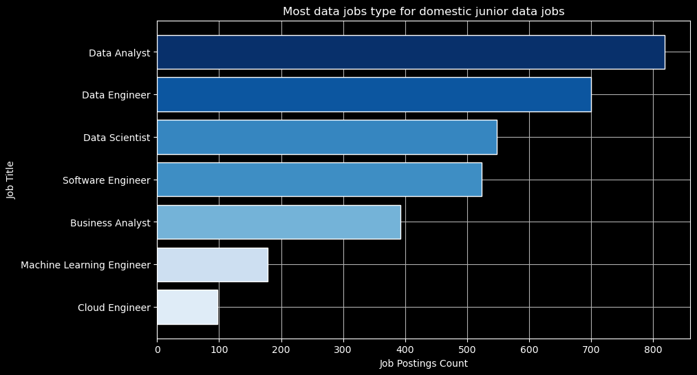
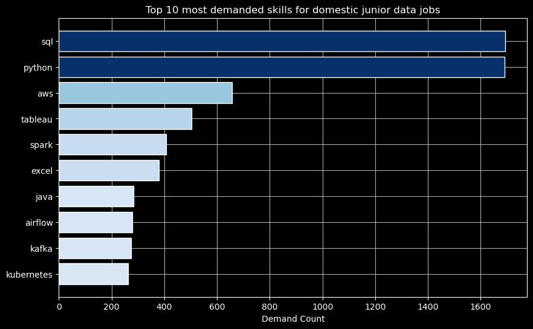

# Data Job Postings Analysis 2023
Analyzing data (and software engineering) job postings from 2023 based on data collected by Luke Barousse for his SQL course. Here I analyze the data using SQL (PostgreSQL as ORDMBS) and graphs using Python to gain insights into remote junior data jobs and in my area, Israel.

**This is not current data (from 2025), this analysis is primarily intended for training and education.**

## About The Data
As mentioned above, this data was collected by Luke Barousse through [datanerd.tech](https://datanerd.tech/) in 2023 and is divided to 4 tables:


- **job_postings_fact**:

The main table with all the information about the job

| job_id | company_id | job_title_short | job_title                  | job_location         | job_via          | job_schedule_type | work_from_home | search_location         | job_posted_date      | no_degree_mention | health_insurance | job_country    | salary_rate | salary_year_avg | salary_hour_avg |
|--------|------------|-----------------|----------------------------|----------------------|------------------|------------------|----------------|-------------------------|----------------------|------------------|-----------------|----------------|-------------|----------------|----------------|
| 0      | 0          | Data Analyst    | Marketing Data Analyst     | Anywhere             | via LinkedIn     | Full-time        | true           | Serbia                  | 2023-09-25 17:46:06 | false            | false           | Serbia         | null        | null           | null           |
| 1      | 617        | Data Analyst    | Sr. Data Analyst           | West Bridgewater, MA | via Adzuna       | Full-time        | false          | New York, United States | 2023-03-02 09:00:54 | false            | true            | United States  | null        | null           | null           |
| 2      | 1364       | Data Analyst    | Data Analyst Data Translator | Naperville, IL    | via LinkedIn     | Full-time        | false          | Illinois, United States | 2023-04-26 21:02:49 | false            | false           | United States  | null        | null           | null           |
| 3      | 106974     | Data Engineer   | Data Engineer              | Canada               | via Trabajo.org  | Full-time        | false          | Canada                  | 2023-05-25 06:27:07 | false            | false           | Canada         | null        | null           | null           |
| 4      | 28182      | Data Engineer   | BI Data Engineer (m/w/d)   | Munich, Germany      | via KTLA Jobs    | Full-time        | false          | Germany                 | 2023-05-26 16:20:12 | true             | false           | Germany        | null        | null           | null           |

with job_id as the PRIMARY KEY and **787,686** <ins> different job postings </ins> (rows).


- **company_dim**:
  
Table for all the companies mentioned in the job_postings_fact table

| company_id | name                      | link                        | link_google                                                                                                                                       | thumbnail                                                                                                                             |
|------------|---------------------------|-----------------------------|--------------------------------------------------------------------------------------------------------------------------------------------------|--------------------------------------------------------------------------------------------------------------------------------------|
| 0          | Cryptology                | null                        | https://www.google.com/search?sca_esv=568425080&gl=us&hl=en&q=Cryptology&sa=X&ved=0ahUKEwiLv6_v1seBAxUjVTUKHU8NDcEQmJACCL0J     | https://encrypted-tbn0.gstatic.com/images?q=tbn:ANd9GcSasIwLJ4AgJ_x7d19N2iIdiuxJL519GTE6sxjWIeA&s                                   |
| 1          | Edraak                    | null                        | https://www.google.com/search?hl=en&gl=us&q=Edraak&sa=X&ved=0ahUKEwiQqpejrbiAAxWsFVkFHZnxCLY4ChCYkAII1Ak                        | https://encrypted-tbn0.gstatic.com/images?q=tbn:ANd9GcRy7BDVLI1v0TTiEd_1-A9erQIeLXnbzmstT3FzCrk&s                                   |
| 2          | Groupe ADP                | http://www.groupeadp.fr/    | https://www.google.com/search?gl=us&hl=en&q=Groupe+ADP&sa=X&ved=0ahUKEwix4rflpLOAAxVILVkFHaXmB9w4PBCYkAII-As                    | https://encrypted-tbn0.gstatic.com/images?q=tbn:ANd9GcRy7BDVLI1v0TTiEd_1-A9erQIeLXnbzmstT3FzCrk&s                                   |
| 3          | Interactive Resources - iR | null                        | https://www.google.com/search?q=Interactive+Resources+-+iR&sa=X&ved=0ahUKEwiRtI28yY_-AhVIMlkFHf_-CWo4WhCYkAIIlQo                | https://encrypted-tbn0.gstatic.com/images?q=tbn:ANd9GcQRy51d7d6kARXhB5XkjLXjztfqG6S3R1JAXhxxWMI&s                                   |
| 4          | Cybernetic Search         | null                        | https://www.google.com/search?gl=us&hl=en&q=Cybernetic+Search&sa=X&ved=0ahUKEwjElfiG-_j9AhXDRzABHcRICk8QmJACCLkJ                 | https://encrypted-tbn0.gstatic.com/images?q=tbn:ANd9GcR8Py43j7ySQpLYB4yBLsFWk5DYTbdR0z8TguNxdLI&s                                   |

with company_id as the PRIMARY KEY and **140,033** <ins> different companies </ins>.

The job_postings_fact table and company_dim table can be linked through company_id column.


- **skills_dim**:

Table for all the skills mentioned

| skill_id | skills | type        |
|----------|--------|-------------|
| 0        | sql    | programming |
| 1        | python | programming |
| 2        | nosql  | programming |
| 3        | scala  | programming |
| 4        | java   | programming |

with skill_id as PRIMARY KEY and **259** <ins> different skills. </ins>


- **skills_job_dim**:

Table to connect the required skills for each job posting

| job_id | skill_id |
|--------|----------|
| 0      | 0        |
| 0      | 1        |
| 0      | 181      |
| 0      | 182      |
| 0      | 183      |

with (job_id, skill_id) as PRIMARY KEY and **3669604** <ins> different combinations </ins>.
This table connect to job_postings_fact through job_id and skills_dim through skill_id.

Base on the different number of rows from job_postings_fact we can assume that each job require more than 1 skill, or about

$$\frac{\text{skills job dim number of rows}}{\text{job postings fact number of rows}} = \frac{3669604}{787686} \approx 4.66 $$

So lets assume that about 5 different skills is required per job


## Tools Used For The Analysis
- **SQL**
- **PostgreSQL**
- **Visual Studio Code**
- **Python (NumPy, Pandas, Matplotlib)**
- **Git**

## The Analysis 

This analysis was focus mainly on junior jobs in Israel (domestic).

The main custom table for most of the analysis (domestic) was:
```sql
WITH domestic_junior_data_jobs AS (
    SELECT
        jpf.*,  -- Select all columns from job_postings_fact
        cd.name AS company_name
    FROM job_postings_fact AS jpf
    INNER JOIN company_dim AS cd ON jpf.company_id = cd.company_id
WHERE
    job_country = 'Israel'
    AND (
        job_title NOT LIKE '%Senior%'
        AND job_title NOT LIKE '%Sr%'
        AND job_title NOT LIKE '%Lead%'
        AND job_title NOT LIKE '%Principal%'
        AND job_title NOT LIKE '%Manager%'
        AND job_title NOT LIKE '%Director%'
    )
)

SELECT * FROM domestic_junior_data_jobs LIMIT 5;
```
And the result is

| Job ID | Company Name | Job Title Short   | Job Title                                       | Location             | Via             | Schedule  | Remote | No Degree Mention | Posted Date          |
|--------|--------------|------------------|-------------------------------------------------|----------------------|-----------------|-----------|--------|------------------|----------------------|
| 342    | VAST Data    | Cloud Engineer   | Customer Success Engineer                       | Tel Aviv-Yafo, Israel | via VAST Data   | Full-time | false     | false               | 2023-03-22 17:50:08 |
| 437    | ADAMA        | Business Analyst | Strategic programs and Business analytics manager | Tel Aviv-Yafo, Israel | via Trabajo.org | Full-time | false     | false               | 2023-03-26 22:35:16 |
| 677    | ZipRecruiter | Data Engineer    | Big Data Engineer                               | Tel Aviv-Yafo, Israel | via LinkedIn    | Full-time | false     | false               | 2023-06-11 12:43:17 |
| 688    | Passportcard | Business Analyst | BI Analyst                                      | Netanya, Israel       | via Comeet      | Full-time | false     | false               | 2023-05-03 07:50:33 |
| 939    | CHEQ         | Data Engineer    | Backend & Data Engineer                         | Tel Aviv-Yafo, Israel | via LinkedIn    | Full-time | false     | true               | 2023-04-27 07:36:08 |

with **3263** different posts, all in Israel.

### 1. Job Types

What is the job type with the most postings?

```sql
WITH domestic_junior_data_jobs AS (
    SELECT
        jpf.*,  -- Select all columns from job_postings_fact
        cd.name AS company_name
    FROM job_postings_fact AS jpf
    INNER JOIN company_dim AS cd ON jpf.company_id = cd.company_id
WHERE
    job_country = 'Israel'
    AND (
        job_title NOT LIKE '%Senior%'
        AND job_title NOT LIKE '%Sr%'
        AND job_title NOT LIKE '%Lead%'
        AND job_title NOT LIKE '%Principal%'
        AND job_title NOT LIKE '%Manager%'
        AND job_title NOT LIKE '%Director%'
    )
)

SELECT 
    djd.job_title_short,
    COUNT(djd.job_id) AS job_postings_count
FROM domestic_junior_data_jobs AS djd
GROUP BY djd.job_title_short
ORDER BY job_postings_count DESC;
```
The output is:

| Job Title Short           | Job Postings Count |
|---------------------------|------------------|
| Data Analyst              | 819              |
| Data Engineer             | 700              |
| Data Scientist            | 548              |
| Software Engineer         | 523              |
| Business Analyst          | 393              |
| Machine Learning Engineer | 178              |
| Cloud Engineer            | 97               |
| Senior Data Scientist     | 4                |
| Senior Data Engineer      | 1                |

As you can see, there are a few senior job postings that were misclassified as junior because my filter was based on the job_title column only. This can be fixed easily by adding another line to the WHERE statement to include the job_title_short (job_title_short NOT LIKE '%Senior%'), but this error was revealed to me later on the analysis and after noticing it I decided to continue with the already existing outputs because all the misclassified senior job are accumulating to 5 postings which is **less than 1%** of the total postings (5/3263) which is not impactful to the analysis in this repository. The average salary per type could not be calculated with accuracy for this table because only about 60 postings is valid for the calculation, which is **about 2%** of the total postings.

This bar graph shows only the junior job postings without the misclassified seniors:



### 2. Most In Demand skills

What is the most in demand skills for juniors?

With the same table, domestic_junior_data_jobs:

```sql
SELECT 
    sd.skills,
    COUNT(sd.skill_id) AS demand_count
FROM domestic_junior_data_jobs AS djd
INNER JOIN skills_job_dim AS sjd ON djd.job_id = sjd.job_id
INNER JOIN skills_dim AS sd ON sjd.skill_id = sd.skill_id
GROUP BY sd.skills
HAVING
    COUNT(sd.skill_id) >= 5
ORDER BY
    demand_count DESC
```

The top 10 most in demand skills are:

| Skill      | Demand Count |
|------------|--------------|
| sql        | 1692         |
| python     | 1691         |
| aws        | 656          |
| tableau    | 503          |
| spark      | 406          |
| excel      | 379          |
| java       | 283          |
| airflow    | 279          |
| kafka      | 275          |
| kubernetes | 262          |



SQL and Python are at the top of the list, with **about 52%** of job postings mentioning them as a requirement. Amazon Web Services (AWS), Tableau, and (Apache) Spark are mentioned in 12%-20% of job postings. This is no coincidence, most of the skills on the list work well with SQL and Python as an easy and efficient tool to use. For example, Python is one of the most popular programming languages ​​in the world and almost every framework/tool/service has a Python-compatible API (libraries/packages) like pyspark for Spark or airflow. Most companies today use cloud services from one of the top three providers: AWS, Microsoft Azure, or Google Cloud. Together, they hold about **63%** of the global cloud infrastructure market share, with AWS leading the market with **30%**.
On average, each job posting listed about 5 skills required for the job, so by examining the data, it is best to learn the top 5 skills to increase your chances of getting a job in this field.

<!-- SQL and Python are at the top of the list, with **about 52%** of job postings listing them as a requirement. Amazon Web Services (AWS), Tableau, and (Apache) Spark are mentioned in 12%-20% of job postings. This is not random, most of the skills in the list works well with SQL and Python as a tools to use them easily and efficiently. For example, Python is one of the most popular programming language in the world and almost every framework/tool/service has an API compacable with Python (libraries/packeges) such as pyspark for Spark or airflow. Most companies today use cloud services from one of the top 3 providers: AWS, Microsoft Azure or Google Cloud. Together, they hold about **63%** market share in the global cloud infrastructure mark and AWS is the market leader with **30%**.
On average, each job posting listed about 5 skills required for the job, so by examining the data, it is best to learn the top 5 skills to increase your chances of getting a job in this field. -->


<!--, and when you think about it, it really makes sense that something like SQL and Python are on the top of the list and tools like .-->


<!--
```sql
WITH domestic_junior_data_jobs AS (
    SELECT
        jpf.*,  -- Select all columns from job_postings_fact
        cd.name AS company_name
    FROM job_postings_fact AS jpf
    INNER JOIN company_dim AS cd ON jpf.company_id = cd.company_id
WHERE
    job_country = 'Israel'
    AND (
        job_title NOT LIKE '%Senior%'
        AND job_title NOT LIKE '%Sr%'
        AND job_title NOT LIKE '%Lead%'
        AND job_title NOT LIKE '%Principal%'
        AND job_title NOT LIKE '%Manager%'
        AND job_title NOT LIKE '%Director%'
    )
)

SELECT 
    sd.skills,
    COUNT(sd.skill_id) AS demand_count
FROM domestic_junior_data_jobs AS djd
INNER JOIN skills_job_dim AS sjd ON djd.job_id = sjd.job_id
INNER JOIN skills_dim AS sd ON sjd.skill_id = sd.skill_id
GROUP BY sd.skills
HAVING
    COUNT(sd.skill_id) >= 5
ORDER BY
    demand_count DESC
```
-->

<!--

-->

## Insights
**Will be added soon**
